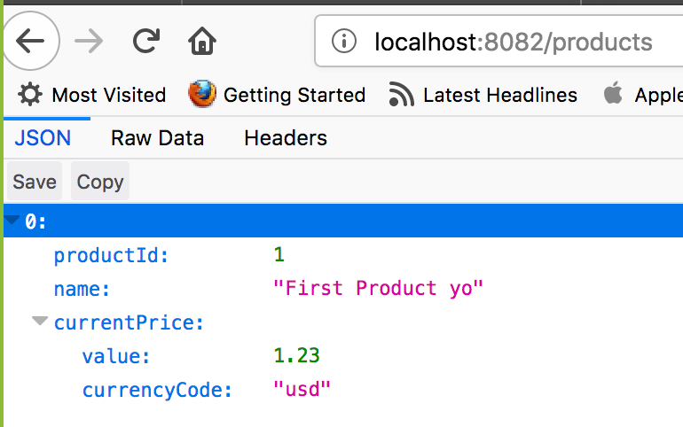
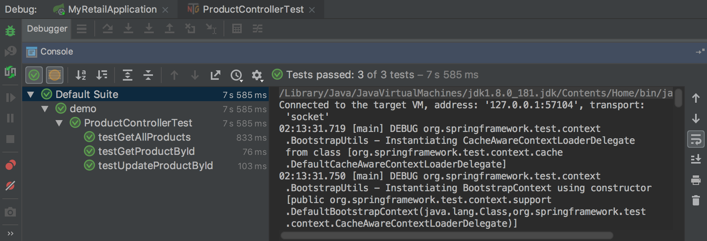

# myRetailCaseStudy

This Spring Boot Application exposes a RESTful API Endpoint that allows consumers to query products by id or retrieve all records. Additionaly this API exposes create & update endpoints using the POST and PUT verbs.




# Setup 
Clone this repository and change into its directory:

```bash
git clone https://github.com/jrosenauer/myRetailCaseStudy.git
cd myRetailCaseStudy
```
# Testing

To run tests you can execute the local `mvnw` script passing the `test` argument:

```bash
$ ./mvnw test

/Users/jessicarosenauer/Downloads/demo
[INFO] Scanning for projects...
[INFO] 
[INFO] --------------------------< com.example:demo >--------------------------
[INFO] Building demo 0.0.1-SNAPSHOT
[INFO] --------------------------------[ jar ]---------------------------------

...

[INFO] 
[INFO] Results:
[INFO] 
[INFO] Tests run: 3, Failures: 0, Errors: 0, Skipped: 0
[INFO] 
[INFO] ------------------------------------------------------------------------
[INFO] BUILD SUCCESS
[INFO] ------------------------------------------------------------------------
[INFO] Total time: 9.583 s
[INFO] Finished at: 2018-09-06T02:17:14-05:00
[INFO] ------------------------------------------------------------------------

```

## Retrieve All Products
```bash
JessicaauersMBP:demo jessicarosenauer$ curl localhost:8082/products/1 -vv
*   Trying ::1...
* TCP_NODELAY set
* Connected to localhost (::1) port 8082 (#0)
> GET /products/1 HTTP/1.1
> Host: localhost:8082
> User-Agent: curl/7.54.0
> Accept: */*
> 
< HTTP/1.1 200 
< Content-Type: application/json;charset=UTF-8
< Transfer-Encoding: chunked
< Date: Thu, 06 Sep 2018 07:12:13 GMT
< 
* Connection #0 to host localhost left intact
{"id":"5b90d293af933f83946b2f3e","productId":1,"name":"First Product","currentPrice":{"value":12.99,"currencyCode":"usd"}}JessicaauersMBP:demo jessicarosenauer$ 
JessicaauersMBP:demo jessicarosenauer$ curl localhost:8082/products
[{"id":"5b90d293af933f83946b2f3e","productId":1,"name":"First Product","currentPrice":{"value":12.99,"currencyCode":"usd"}}]
```

## Retrieve Product by Id
```bash
JessicaauersMBP:demo jessicarosenauer$ curl localhost:8082/products/1
{"id":"5b90d293af933f83946b2f3e","productId":1,"name":"Some new product name","currentPrice":{"value":12.99,"currencyCode":"usd"}}
```